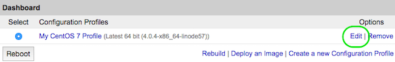
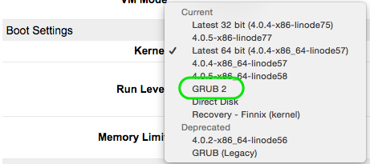

Run a Distribution-Supplied Kernel on a KVM Linode
==================================================

This guide explains how to enable the kernels your OS provides for a KVM Linode. This is useful if you’d like to enable specific kernel features, or you’d prefer to handle kernel upgrades directly. These steps have been tested on:

* Ubuntu 14.04

Before you get started, make sure you follow the steps outlined in Linode `Getting Started <https://www.linode.com/docs/getting-started>`_ guide. Your Linode needs to be in a functional state. These steps should be performed as ``root`` on your Linode, via an SSH session.

Installing the Distribution Provided Kernel
-------------------------------------------

1. Ensure that your system is up to date, using the distribution’s package manager.
2. Use ``uname`` to identify the current kernel version:

.. code:: bash

    uname -a

The output will be similar to that shown below:

.. code:: bash

    Linux localhost 4.0.4-x86_64-linode57 #1 SMP Thu May 21 11:01:47 EDT 2015 x86_64 x86_64 x86_64 GNU/Linux

3. Make a note of the kernel you’re currently using (``4.0.4-x86_64`` in our example). You will be replacing it with the current latest kernel supplied by your Linux distribution.
4. Install the Linux kernel. The package name differs based on your distribution:

    * Ubuntu 14.04

    .. code:: bash

        apt-get install linux-image-virtual grub2

.. note::

    During the installation of ``grub`` you may be asked which disk image to install to. Since Linode provides the grub bootloader, the system need only provide the ``grub.cfg`` file, and you don’t need to install ``grub`` to your MBR.

5. Verify the kernel version provided by your distribution in /boot:

.. code:: bash

    # ls /boot/vmlinuz*
    /boot/vmlinuz-3.16.0-4-amd64

Configuring Grub
----------------

1. Edit ``/etc/default/grub`` and add or change the following variables to match the following. There will be other variables in this file, but we are only concerned with those listed below:

    File excerpt: **/etc/default/grub**

    .. code::

        GRUB_TIMEOUT=10
        GRUB_CMDLINE_LINUX="console=ttyS0,19200n8"
        GRUB_DISABLE_LINUX_UUID=true
        GRUB_SERIAL_COMMAND="serial --speed=19200 --unit=0 --word=8 --parity=no --stop=1"

2. Run the following command to update the bootloader.

    * Ubuntu 14.04

    .. code::

        update-grub

.. note::

    Note that if you later install an updated kernel, you’ll need to run this command again to update your GRUB menu. By default, the first kernel in the list will be booted.

Rebooting into Grub2 Mode
-------------------------

1. In your Linode’s Dashboard, Click on **Edit** under the Configuration Profiles section:

2. In the Boot Settings section, select **GRUB 2** from the **Kernel** drop down menu:

3. At the bottom of the page, click on **Save Changes**.

4. Reboot your Linode. You can monitor the boot process in the `LISH console <https://www.linode.com/docs/networking/using-the-linode-shell-lish>`_.

.. note::

    During boot you may see this error message:

    .. code:: bash

        error: file `/boot/grub/i386-pc/all_video.mod' not found.
        Loading Linux linux ...
        Loading initial ramdisk ...

        Press any key to continue...

    You can safely ignore it.

5. After logging back in to your Linode, run ``uname -a`` again to confirm the new kernel:

.. code:: bash

    Linux li63-119.members.linode.com 3.10.0-229.4.2.el7.x86_64.debug #1 SMP Wed May 13 10:20:16 UTC 2015 x86_64 x86_64 x86_64 GNU/Linux

