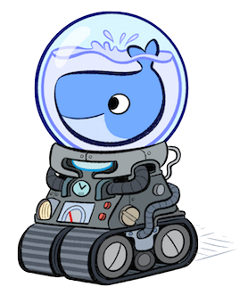

Docker-Machine
==============

What is Docker-Machine?
-----------------------

Machine lets you create Docker hosts on your computer, on cloud providers, and inside your own data center. It automatically creates hosts, installs Docker on them, then configures the docker client to talk to them. A “machine” is the combination of a Docker host and a configured client.

|logo|

**For more, see**: http://docs.docker.com/machine/

Install Docker Machine
----------------------

Docker Machine is supported on Windows, OS X, and Linux and is installable as one standalone binary. The links to the binaries for the various platforms and architectures are available at the `Github`_ Release page.

 * OS X and Windows

    Install Machine using the Docker Toolbox using the Mac OS X installation instruction or Windows installation instructions.

 * On Linux

    To install on Linux, do the following:

Install Docker version 1.7.1 or greater:

Download the Machine binary to somewhere in your PATH (for example, /usr/local/bin).

.. code-block:: sh

    $ curl -L https://github.com/docker/machine/releases/download/v0.4.1/docker-machine_linux-amd64 > /usr/local/bin/docker-machine

Apply executable permissions to the binary:

.. code-block:: sh

    $ chmod +x /usr/local/bin/docker-machine

Check the installation by displaying the Machine version:

.. code-block:: sh

    $ docker-machine -v
    machine version 0.4.0

Where to go next
Docker Machine overview
Docker Machine driver reference
Docker Machine subcommand reference

.. _Github: https://github.com/docker/machine

