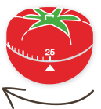
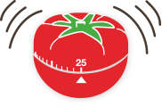
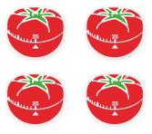

Pomodoro technique
==================

.. note:: DO MORE AND HAVE FUN WITH TIME MANAGEMENT

WHAT IS THE POMODORO TECHNIQUE?
-------------------------------

.. raw:: html

    

            <iframe width="560" height="315" src="https://www.youtube.com/embed/CT70iCaG0Gs" frameborder="0" allowfullscreen></iframe>
    

=================================== ==============================================  ======================
|icon1| **EASY** for anyone to use! |icon2| Improves productivity **IMMEDIATELY!**  |icon3| **FUN** to do!
=================================== ==============================================  ======================

HOW IT WORKS:
-------------

The fundamentals of the Pomodoro Technique are simple yet incredibly effective.

    |how1|
    1. CHOOSE A TASK YOU'D LIKE TO GET DONE:

    Something big, something small, something you’ve been putting off for a million years: it doesn’t matter. What matters is that it’s something that deserves your full, undivided attention.

    |how2|
    2. SET THE POMODORO FOR 25 MINUTES:

    Make a small oath to yourself: I will spend 25 minutes on this task and I will not interrupt myself. You can do it! After all, it’s just 25 minutes.

    |how3|
    3. WORK ON THE TASK UNTIL THE POMODORO RINGS

    Immerse yourself in the task for the next 25 minutes. If you suddenly realize you have something else you need to do, write the task down on a sheet of paper.

    |how4|
    4. WHEN THE POMODORO RINGS, PUT A CHECKMARK ON A PAPER

    Congratulations! You’ve spent an entire, interruption-less Pomodoro on a task.

    |how5|
    5. TAKE A SHORT BREAK

    Breathe, meditate, grab a cup of coffee, go for a short walk or do something else relaxing (i.e., not work-related). Your brain will thank you later.

    |how6|
    6. EVERY 4 POMODOROS, TAKE A LONGER BREAK

    Once you’ve completed four pomodoros, you can take a longer break. 20 minutes is good. Or 30. Your brain will use this time to assimilate new information and rest before the next round of Pomodoros.

You may also want the following docs:

    * `The Pomodoro Technique`_
    * `Pomodoro Cheat Sheet`_
    * `Pomodoro Inventory`_

For more info, please see `Pomodoro Technique`_.

.. _Pomodoro Technique: http://pomodorotechnique.com
.. _The Pomodoro Technique: http://caps.ucsd.edu/Downloads/tx_forms/koch/pomodoro_handouts/ThePomodoroTechnique_v1-3.pdf
.. _Pomodoro Cheat Sheet: http://caps.ucsd.edu/Downloads/tx_forms/koch/pomodoro_handouts/pomodoro_cheat_sheet.pdf
.. _Pomodoro Inventory: http://pomodorotechnique.com/download/sheets/pomodoro-inventory-A4.pdf